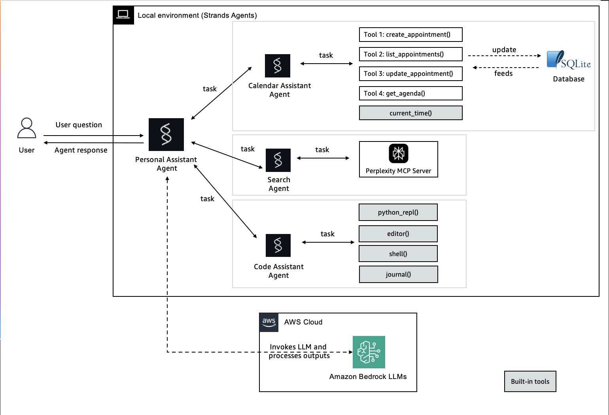

# Personal Assistant with Strands Agents

This sample implements a personal assistant agent using Strands' [agents as tools](https://strandsagents.com/latest/user-guide/concepts/multi-agent/agents-as-tools/) functionality.


## 🏗️ Architecture Overview


## 🌟 Agent tools

### 📅 Calendar Assistant
- **Create Appointments**: Schedule new appointments with date, time, location, and descriptions
- **List All Appointments**: View all scheduled appointments in a formatted list
- **Update Appointments**: Modify existing appointments by ID
- **Daily Agenda**: Get a formatted agenda for any specific date
- **Time Awareness**: Built-in current time functionality

### 💻 Coding Assistant  
- **Python REPL**: Execute Python code in a REPL environment with PTY support and state persistence.
- **Editor**: Editor tool designed to do changes iteratively on multiple files.
- **Shell Access**: Interactive shell tool with PTY support for real-time command execution and interaction.
- **Journal**: Daily journal management tool for Strands Agent.

### 🔍 Search Agent
- **Web Search**: Powered by Perplexity MCP Server for real-time information

## 🚀 Getting Started

### Prerequisites
- Python 3.10+
- [Docker](https://www.docker.com/) installed and running
- AWS Account with Bedrock access
- Strands Agents installed
- Required Python packages (see requirements.txt)

### Installation

1. **Clone the repository**:
```bash
git clone https://github.com/strands-agents/samples.git
cd python/04-industry-use-cases/productivity/personal-assistant
```

2. **Set up Python virtual environment**:
```bash
python -m venv .venv
source .venv/bin/activate  # On Windows: .venv\Scripts\activate
```

2. **Install dependencies**:
```bash
pip install -r requirements.txt
```

3. **Configure AWS credentials**:
```bash
aws configure
# OR set environment variables
export AWS_ACCESS_KEY_ID=your_access_key
export AWS_SECRET_ACCESS_KEY=your_secret_key
export AWS_DEFAULT_REGION=us-east-1
```

4. **Set up Perplexity API** (for search functionality):
```bash
export PERPLEXITY_API_KEY=your_perplexity_api_key
```

### Quick Start

#### Calendar Assistant
```bash
python -u calendar_assistant.py
```

#### Coding Assistant
```bash
python -u coding_assistant.py
```

#### Search Assistant
```bash
python -u search_assistant.py
```

#### Personal Assistant (multi-agent collaboration)
```bash
python -u personal_assistant.py
```

## 🛠️ Usage Examples

### Calendar Agent
```
👤 You: Schedule a dentist appointment for tomorrow at 2 PM
🤖 CalendarBot: ✅ Appointment Created Successfully!
================================
📅 Date: 2024-01-15
🕐 Time: 14:00
📍 Location: Dental Clinic
📝 Title: Dentist Appointment
🆔 ID: abc123-def456-ghi789
```

### Coding Agent
```
👨‍💻 You: Create a Python function to calculate fibonacci numbers
🤖 CodingBot: I'll create an efficient fibonacci function for you...
```

### Search Agent 
```
👨‍💻 You: What is Strands Agents?
🤖 WebSearchBot: Let me search about Strands Agents...
```

### Daily Agenda
```
👤 You: What's my agenda for today?
🤖 CalendarBot: 📅 Agenda for 2024-01-15:
==============================
1. 🕐 09:00 - Team Meeting
   📍 Location: Conference Room A
   🆔 ID: meeting123
```

## 🔧 Configuration

### Environment Variables
```bash
# AWS Configuration
AWS_ACCESS_KEY_ID=your_aws_access_key
AWS_SECRET_ACCESS_KEY=your_aws_secret_key
AWS_DEFAULT_REGION=us-east-1

# Search Integration
PERPLEXITY_API_KEY=your_perplexity_api_key
```

**Happy Assisting!** 🤖✨